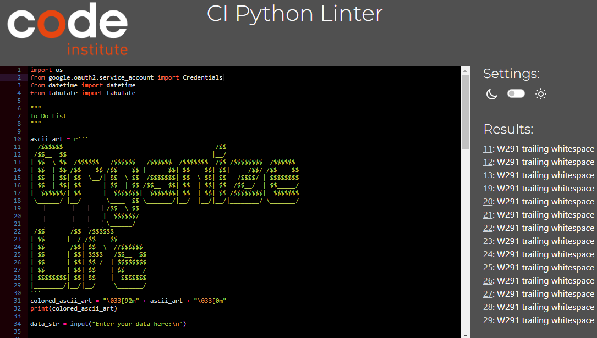

Welcome,


# Introduction

Welcome to Organized Life, your go-to Python-based to-do list application designed to help you manage your tasks efficiently and keep your life organized. With Organized Life, you can seamlessly track the date when tasks are created, mark them as done, and stay on top of your responsibilities.


Visit the deployed application at [Heroku](https://)

## CONTENT

* [Introduction](#introduction)
  * [Objectives](#objectives)
  * [Developer's goal](#developers-goal)
  * [User's goal](#users-goal)
* [User Experience](#user-experience)
  * [The Strategy](#the-strategy)
  * [The Structure](#the-structure)
  * [User stories](#user-stories)
* [Design](#design)
  * [Color Usage in Application](#color-usage-in-application)
  * [Accessibility](#accessibility)
  * [Am I Responsive](#am-i-responsive)
* [Existing features](#existing-features)
* [Future features](#future-features)
* [Technologies used](#technologies-used)
  * [Language](#language)
  * [Tools](#tools)
* [Data Model](#data-model)
  * [Flowchart](#flowchart)
  * [Functions & Error Handling](#functions--error-handling)
  * [Error Handling Strategy](#error-handling-strategy)
  * [Imports](#imports)
  * [Programming paradigm](#programming-paradigm)
* [Testing](#testing)
* [Prerequisites and Deployment](#prerequisites-and-deployment)
  * [Prerequisite](#prerequisite)
  * [Deploying on Heroku](#deploying-on-heroku)
  * [Essential when creating the Heroku app](#Essentials)
  * [Local Deployment](#local-deployment)
  * [How to Clone](#how-to-clone)
  * [Forking](#forking)
* [Credits](#credits)
   * [Content](#content)
   * [Media](#media)
   * [Acknowledgements](#acknowledgements)

## Introduction

### Objectives

#### Developer's goal

The goal of Organized Life is to provide users with a simple, intuitive, and effective tool for managing their daily tasks and responsibilities. As developers, our mission is to create a robust, user-friendly application that enhances productivity and simplifies task management.

Key objectives of Organized Life include:

- Simplicity and Ease of Use: We aim to make Organized Life accessible to users of all technical levels. The application should be straightforward to install, set up, and use, with a clean and intuitive interface that minimizes the learning curve.

- Efficiency: Our goal is to help users manage their tasks efficiently. By allowing users to track the creation date of tasks and mark them as done, we ensure that users can stay organized and focused on their priorities.

- Reliability: We strive to develop a reliable application that users can depend on for their day-to-day task management. This includes ensuring the software is free of bugs, regularly updated, and capable of handling users' needs without performance issues.

- Customization: Recognizing that each user's needs are unique, we aim to provide customizable features that allow users to tailor the application to their specific requirements. This includes customizable task categories, priorities, and notifications.

- Scalability: While Organized Life is designed as a personal task management tool, we aim to develop it with scalability in mind, allowing it to grow and evolve with additional features and integrations based on user feedback and emerging needs.

By focusing on these goals, we hope to create a valuable tool that users can rely on to keep their lives organized and productive. Thank you for choosing Organized Life, and we look forward to helping you achieve your task management goals.

#### User's goal

The primary goal for users of Organized Life is to streamline their task management processes and boost productivity. With Organized Life, users can expect to:

- Stay Organized: Users can easily keep track of all their tasks in one place, ensuring that nothing falls through the cracks.

- Improve Time Management: By tracking when tasks are created and completed, users can better manage their time and prioritize tasks effectively.

- Increase Productivity: With features like task marking and categorization, users can quickly identify and focus on the most important tasks, enhancing overall productivity.

- Customize Their Experience: Users have the flexibility to customize their task lists according to their personal preferences and needs, making the application work best for them.

- Maintain Consistency: By regularly using Organized Life, users can develop consistent task management habits that contribute to long-term success in both personal and professional areas.

*<span style="color: blue;">[Back to Content](#content)</span>*
---


## Technologies Used

### Language

[Python](https://www.python.org) is used as the back-end programming language.

### Tools

* [Code Institute Python Linter](https://pep8ci.herokuapp.com/): A tool to check Python code against some of the style conventions in [PEP8](https://peps.python.org/pep-0008/).
* [Lucidchart](https://lucid.app/): Useful for planning the application's architecture and flowcharts, especially helpful in the design phase to visualize the application flow.
* [Git](https://git-scm.com) used for version control. (```git add```, ```git commit```, ```git push```)
* [Visual Studio Code](https://code.visualstudio.com/): A versatile and powerful IDE that supports Python development well, offering debugging tools, extensions for Python, and integrated Git control. While Gitpod provides its own web-based VS Code editor, one might use the desktop version for local development or when offline.
* [Gitpod](https://gitpod.io) Streamlines your development process by providing a pre-configured, cloud-based development environment that's instantly ready for coding.
* [GitHub](https://github.com) Essential for version control, allowing you to track changes, collaborate with others (if applicable), and secure online code storage.
* [Heroku](https://www.heroku.com): A platform for deploying and hosting web applications. 
* [Markup Validation Service](https://validator.w3.org/) - Used to check code ensuring that my HTML is error-free and adheres to the latest web standards.
* [PEP8](https://peps.python.org/pep-0008/): Style Guide for Python Code.

*<span style="color: blue;">[Back to Content](#content)</span>*

---

## Validation

### PEP8 validator 

* [CI Python Linter](https://pep8ci.herokuapp.com/) was used to validate the python code. The results show that there is trailing whitespace. The reason why I added trailing whitespaces from line 11 to line 29 was because it was neccessary to have it to accomplish my formatting of the ''Organize life'' ascci art.
Other than that, no errors were found.



*<span style="color: blue;">[Back to Content](#content)</span>*

- - -


## Creating the Heroku app

The Application has been deployed from GitHub to Heroku by following the steps:

1. Create or log in to your account at heroku.com
2. Create a new app, add a unique app name ( for example corri-construction-p3) and then choose your region
3. Click on create app
4. Go to "Settings"
5. Under Config Vars add the private API key information using key 'CRED' and into the value area copy the API key information added to the .json file.  Also add a key 'PORT' and value '8000'.
6. Add required buildpacks (further dependencies). For this project, set it up so Python will be on top and Node.js on bottom
7. Go to "Deploy" and select "GitHub" in "Deployment method"
8. To connect Heroku app to your Github repository code enter your repository name, click 'Search' and then 'Connect' when it shows below.
9.  Choose the branch you want to build your app from
10. If preferred, click on "Enable Automatic Deploys", which keeps the app up to date with your GitHub repository
11. Wait for the app to build. Once ready you will see the “App was successfully deployed” message and a 'View' button to take you to your deployed link.

---

## Credits

### Content

This application was made possible by leveraging insights and code examples from a range of external resources. Below is a list of these key sources, which have significantly contributed to the functionality and design of the application.

* [os](https://www.geeksforgeeks.org/os-module-python-examples/?ref=lbp) - The os module in Python provides a way to interface with the underlying operating system, allowing you to perform tasks like navigating the file system, managing files, and executing system commands, enhancing portability and interaction with the host environment.
* [import datetime](https://www.geeksforgeeks.org/python-datetime-module/) - For handling date and time operations.
* [tabulate](https://pypi.org/project/tabulate/) - Used for organizing tabular data.
* [Try - Except](https://www.w3schools.com/python/python_try_except.asp) - For robust error management.

*<span style="color: blue;">[Back to Content](#content)</span>*

### Media

For this project, no external media was used for the creation of this project.

*<span style="color: blue;">[Back to Content](#content)</span>*

### Acknowledgements 

A big thanks to

* My mentor [Jubril Akolade](https://github.com/jubrillionaire/)
* The whole team at [Code Institute Slack community](https://code-institute-room.slack.com) for their teaching and support.

*<span style="color: blue;">[Back to Content](#content)</span>*