# Introduction

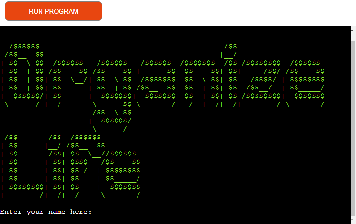

Welcome to Organized Life, your go-to Python-based to-do list application designed to help you manage your tasks efficiently and keep your life organized. With Organized Life, you can seamlessly track the date when tasks are created, mark them as done, and stay on top of your responsibilities.


Visit the deployed application at [Heroku](https://organized-life-a4f96feabeb5.herokuapp.com/)

## CONTENT

* [Introduction](#introduction)
  * [Objectives](#objectives)
  * [Developer's goal](#developers-goal)
  * [User's goal](#users-goal)
* [User Experience](#user-experience)
  * [User stories](#user-stories)
* [Design](#design)
  * [Color Usage in Application](#color-usage-in-application)
  * [Am I Responsive](#am-i-responsive)
* [Features](#existing-features)
* [Technologies used](#technologies-used)
  * [Language](#language)
  * [Tools](#tools)
* [Data Model](#data-model)
  * [Flowchart](#flowchart)
  * [Functions & Error Handling](#functions--error-handling)
  * [Error Handling](#error-handling-strategy)
  * [Imports](#imports)
* [Testing](#testing)
* [Prerequisites and Deployment](#prerequisites-and-deployment)
  * [Prerequisite](#prerequisite)
  * [Deploying on Heroku](#deploying-on-heroku)
  * [Essential when creating the Heroku app](#Essentials)
  * [Local Deployment](#local-deployment)
  * [How to Clone](#how-to-clone)
  * [Forking](#forking)
* [Credits](#credits)
   * [Content](#content)
   * [Media](#media)
   * [Acknowledgements](#acknowledgements)

### Objectives

#### Developer's goal

The goal of Organized Life is to provide users with a simple, intuitive, and effective tool for managing their daily tasks and responsibilities. As developers, our mission is to create a robust, user-friendly application that enhances productivity and simplifies task management.

Key objectives of Organized Life include:

- Simplicity and Ease of Use: We aim to make Organized Life accessible to users of all technical levels. The application should be straightforward to install, set up, and use, with a clean and intuitive interface that minimizes the learning curve.

- Efficiency: Our goal is to help users manage their tasks efficiently. By allowing users to track the creation date of tasks and mark them as done, we ensure that users can stay organized and focused on their priorities.

- Reliability: We strive to develop a reliable application that users can depend on for their day-to-day task management. This includes ensuring the software is free of bugs, regularly updated, and capable of handling users' needs without performance issues.

- Customization: Recognizing that each user's needs are unique, we aim to provide customizable features that allow users to tailor the application to their specific requirements. This includes customizable task categories, priorities, and notifications.

- Scalability: While Organized Life is designed as a personal task management tool, we aim to develop it with scalability in mind, allowing it to grow and evolve with additional features and integrations based on user feedback and emerging needs.

By focusing on these goals, we hope to create a valuable tool that users can rely on to keep their lives organized and productive. Thank you for choosing Organized Life, and we look forward to helping you achieve your task management goals.

#### User's goal

The primary goal for users of Organized Life is to streamline their task management processes and boost productivity. With Organized Life, users can expect to:

- Stay Organized: Users can easily keep track of all their tasks in one place, ensuring that nothing falls through the cracks.

- Improve Time Management: By tracking when tasks are created and completed, users can better manage their time and prioritize tasks effectively.

- Increase Productivity: With features like task marking and categorization, users can quickly identify and focus on the most important tasks, enhancing overall productivity.

- Customize Their Experience: Users have the flexibility to customize their task lists according to their personal preferences and needs, making the application work best for them.

- Maintain Consistency: By regularly using Organized Life, users can develop consistent task management habits that contribute to long-term success in both personal and professional areas.

*<span style="color: blue;">[Back to Content](#content)</span>*
---

## Features
These features aim to transform the to-do list app into an all-encompassing solution for efficient task management, addressing the requirements of a diverse user base seeking an uncomplicated yet powerful method to arrange their everyday duties. The to-do list app is equipped with numerous intuitive features intended to boost task organization and productivity. Here’s a summary of its main features:

### Landing page

The landing page has a big visible ascii art that shows the python app's name.
Where at the bottom of the banner, the first input for the user is to write their name.


### Task Management


Thereafter the menu for the To-do list pops up with a welcome text and the user's name.
A text with the question: "What do you want to do?" is shown.
Below that text, the app allows the user to choose between 5 different options.

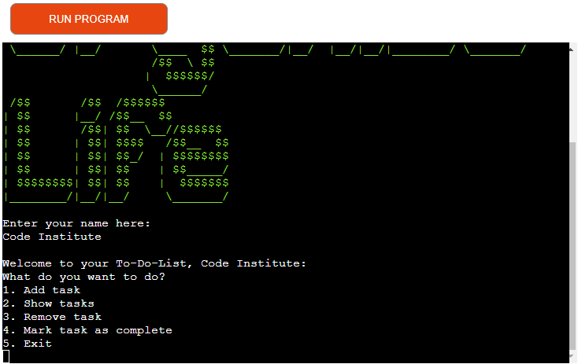

### Task addition

When the user picks number 1, a question pops up asking: ''What would you like to add?"

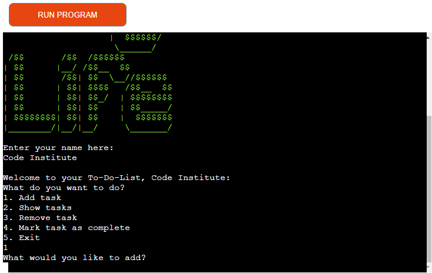

### Task added

After the user have typed in their ask, a ''Task added: 'desired task', with ID 1" and below that text, another text that says 'Current tasks for 'user-name' will appear in a tabulated table with the tasks ID, name, date creation and the status of the task if it's completed or not, if the task was just added, it automatically shows a red ''X''.

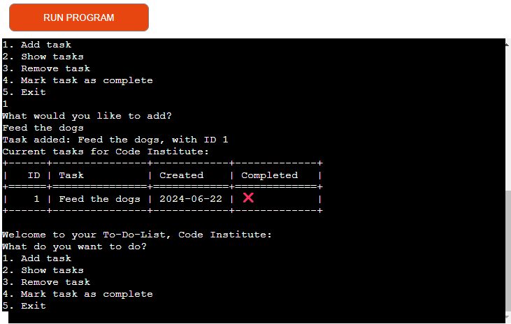

### Task ID

Every task that's added gets its own unique ID name, depending on which order they were created, for example: 1,2,3 etc. for the user to easily being able to choose from.

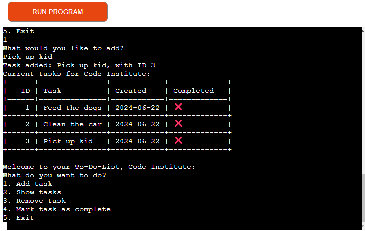

### Mark task as completed

When the user adds which task to mark as completed, a text that confirms that saying "Task with ID 'number' is now marked as completed.

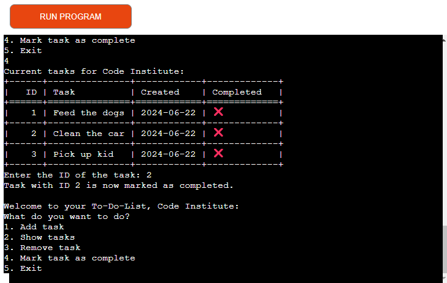


### Task marked as completed

After the user have marked a task as completed and then choses number 2 to show tasks, the user will see that the desired task is now marked with a clear green checkbox.

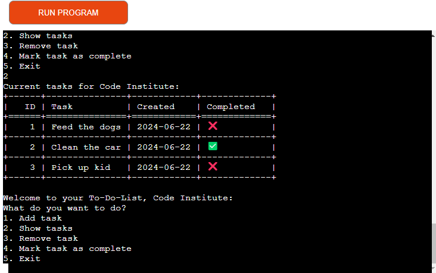


### Remove Task

If the user wants to remove a task, by entering number 3, the app will ask the user to ''Input the ID of the task you want to remove". When the user have chosen their desired task for example '1', the app will confirm that with the text "Task successfully removed with ID: 1.

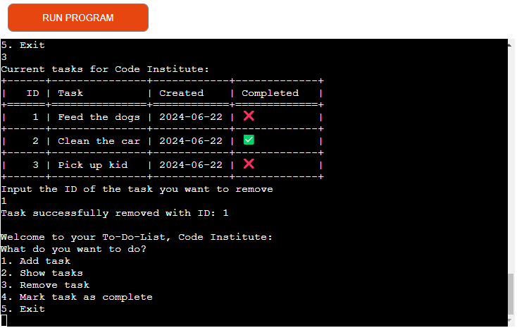


### Exit Application

To exit the application, the user only have to press number 5. A text will appear saying: "Thank you for using the To-Do-List Application ''user-name''.

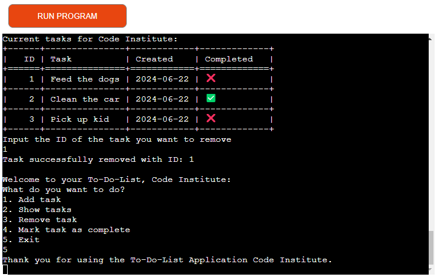
---


## Error handling

User enters blank or whitespace in user input.

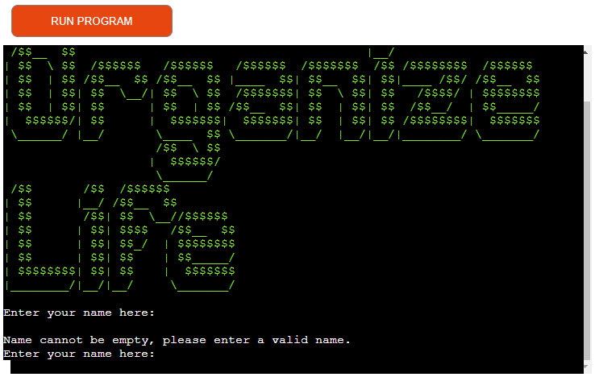


User inputs to show task without any tasks saved.

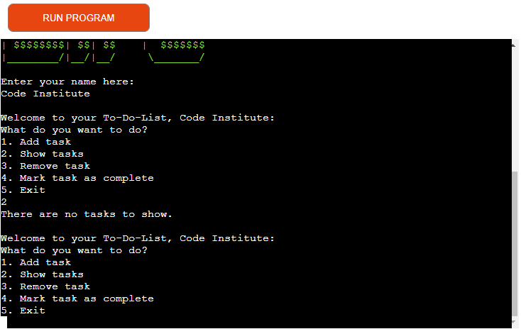

User inputs to remove task without any tasks being saved.

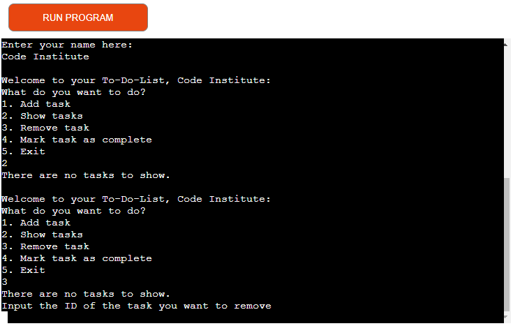

User inputs to mark task as completed without any tasks being saved.

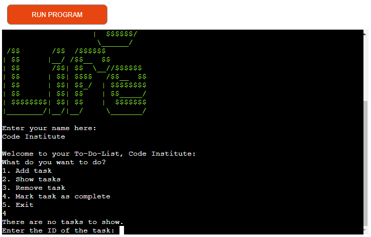
---


## Design

### Am I Responsive

A Command Line Interface app isn't inherently aimed at responsiveness in the context of varying screen sizes and interactive web design because it is primarily designed for interaction through a terminal or command prompt, not a graphical user interface or web browsers. The teaser image from "Am I Responsive" highlights this contrast by showing the app's interface in various device frames, illustrating that a CLI app's user experience and layout do not adapt like a web application designed with responsive web design principles.

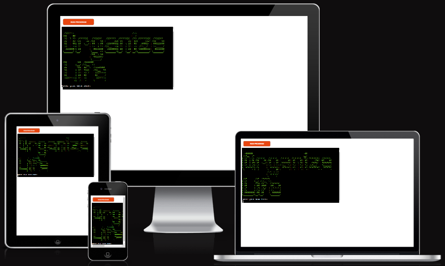

*<span style="color: blue;">[Back to Content](#content)</span>*
---


## Technologies Used

### Language

[Python](https://www.python.org) is used as the back-end programming language.

### Tools

* [Code Institute Python Linter](https://pep8ci.herokuapp.com/): A tool to check Python code against some of the style conventions in [PEP8](https://peps.python.org/pep-0008/).
* [Lucidchart](https://lucid.app/): Useful for planning the application's architecture and flowcharts, especially helpful in the design phase to visualize the application flow.
* [Git](https://git-scm.com) used for version control. (```git add```, ```git commit```, ```git push```)
* [Visual Studio Code](https://code.visualstudio.com/): A versatile and powerful IDE that supports Python development well, offering debugging tools, extensions for Python, and integrated Git control. While Gitpod provides its own web-based VS Code editor, one might use the desktop version for local development or when offline.
* [Gitpod](https://gitpod.io) Streamlines your development process by providing a pre-configured, cloud-based development environment that's instantly ready for coding.
* [GitHub](https://github.com) Essential for version control, allowing you to track changes, collaborate with others (if applicable), and secure online code storage.
* [Heroku](https://www.heroku.com): A platform for deploying and hosting web applications. 
* [Markup Validation Service](https://validator.w3.org/) - Used to check code ensuring that my HTML is error-free and adheres to the latest web standards.
* [PEP8](https://peps.python.org/pep-0008/): Style Guide for Python Code.

*<span style="color: blue;">[Back to Content](#content)</span>*
---

## Testing

### Results and known issues
Please refer to the [TESTING.md](/TESTING.md) file for all testing and troubleshooting carried out.

*<span style="color: blue;">[Back to Content](#content)</span>*
---


## Deploying the App on Heroku

To deploy the application from GitHub to Heroku, follow these steps:

1. Create an account or log in at heroku.com.
2. Create a new app, providing a unique name (e.g., corri-construction-p3), and select your region.
3. Click "Create app."
4. Navigate to the "Settings" tab.
5. Under "Config Vars," add your private API key with 'CRED' as the key and the corresponding value from your .json file. Also, add a key 'PORT' with the value '8000'.
6. Add the necessary buildpacks, ensuring Python is listed first and Node.js second.
7. Go to the "Deploy" tab and choose "GitHub" as the deployment method.
8. Connect your Heroku app to your GitHub repository by entering the repository name, clicking 'Search,' and then 'Connect.'
9. Select the branch you wish to deploy.
10. Optionally, enable "Automatic Deploys" to keep your app in sync with your GitHub repository.
11. Wait for the app to build. Once the deployment is successful, you will see an "App was successfully deployed" message and a 'View' button to access your deployed app.

---


### How to Clone

To clone the project repository:

1. Log in (or sign up) to GitHub.
2. Go to the repository for this project, [Enzolita/organized-life](https://github.com/Enzolita/Organized-life)
3. Click on the code button, select whether you would like to clone with HTTPS, SSH or GitHub CLI and copy the link shown.
4. Open Git Bash or Terminal.
5. Change the current working directory to the location you want to use for the cloned directory.
6. In your IDE Terminal, type the following command to clone my repository:
	- `git clone https://github.com/Enzolita/Organized-life`
7. Press Enter to create your local clone.

*<span style="color: blue;">[Back to Content](#content)</span>*

### Forking

Forking the GitHub Repository allows us to create a duplicate of the original repository in our own GitHub account. This enables us to explore and modify the content without impacting the original repository. To fork this repository, follow these steps:

1. Log in to GitHub and locate the [GitHub Repository](https://github.com/Enzolita/Organized-life)
2. At the top of the Repository (not the top of the page) just above the "Settings" Button on the menu, locate the "Fork" Button.
3. Once clicked, you should now have a copy of the original repository in your own GitHub account.

*<span style="color: blue;">[Back to Content](#content)</span>*


## Credits

### Content

This application was made possible by leveraging insights and code examples from a range of external resources. Below is a list of these key sources, which have significantly contributed to the functionality and design of the application.

* [os](https://www.geeksforgeeks.org/os-module-python-examples/?ref=lbp) - The os module in Python provides a way to interface with the underlying operating system, allowing you to perform tasks like navigating the file system, managing files, and executing system commands, enhancing portability and interaction with the host environment.
* [import datetime](https://www.geeksforgeeks.org/python-datetime-module/) - For handling date and time operations.
* [tabulate](https://pypi.org/project/tabulate/) - Used for organizing tabular data.
* [Try - Except](https://www.w3schools.com/python/python_try_except.asp) - For robust error management.

*<span style="color: blue;">[Back to Content](#content)</span>*

### Media

For this project, no external media was used for the creation of this project.

*<span style="color: blue;">[Back to Content](#content)</span>*

### Acknowledgements 

A big thank you to

* My mentor [Jubril Akolade](https://github.com/jubrillionaire/)
* The whole team at [Code Institute Slack community](https://code-institute-room.slack.com)

*<span style="color: blue;">[Back to Content](#content)</span>*