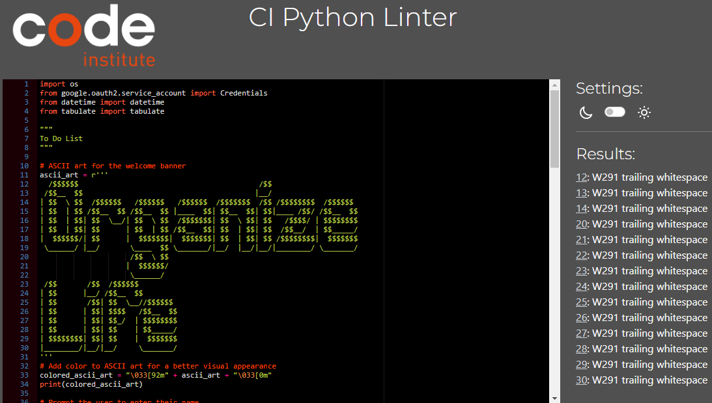

# Testing

The deployed project live link is [HERE](https://organized-life-a4f96feabeb5.herokuapp.com/) - ***Use Ctrl (Cmd) and click to open in a new window.*** 

To ensure the portal is working correctly, the following tests were executed.

## Function Testing

#### Normal Test Case (NRM)

| **Feature**   | **Action**                    | **Expected Result**          | **Actual Result** |
| ------------- | ----------------------------- | ---------------------------- | ----------------- |
| Name input | User is asked to enter their name | Name input| Works as expected | 
| Name input | User inputs blank space or whitespace | Error message appears | Works as expected | 
| Add task | Fill in the prompted fields and submit the task. | User gets asked what they would like to add | Works as expected | 
| Show tasks | User selects the option to show all tasks. | All tasks from the dictionary are displayed in a tabulated table with details such as Task ID, description and dates. | Works as expected |
| Show task | Fill in the prompted fields without any tasks saved | Error message appears | Works as expected |
| Remove task | The specified tasks are removed from the dictionary | Delete specific task(s) by entering Task ID(s). | Works as expected |
| Remove task | Fill in the prompted fields without any tasks saved | Error message appears | Works as expected |
| Mark task as complete | The user gets asked to enter the task's ID | Tells the user that the task with the desired ID is marked as completed | Works as expected |
| Mark task as complete | The user selects to show tasks | Shows the user that task is completed with a green checkbox | Works as expected |
| Mark task as complete | Fill in the prompted fields without any tasks saved | Error message appears | Works as expected |
| Exit application | User selects the option to exit the application | Application stops | Works as expected |

## Testing Browsers
The portal was tested in the following browsers (based on my own testing and those of people who tested the portal):

- Chrome
- Oprea

Code works without issues in the above browsers.

## Validation

### PEP8 validator 

* [CI Python Linter](https://pep8ci.herokuapp.com/) was used to validate the python code. The results show that there is trailing whitespace. The reason why I added trailing whitespaces from line 12 to line 30 was because it was neccessary to have it to accomplish my formatting of the ''Organize life'' ascci art.
Other than that, no errors were found.

*[Back to Content](#content)*
